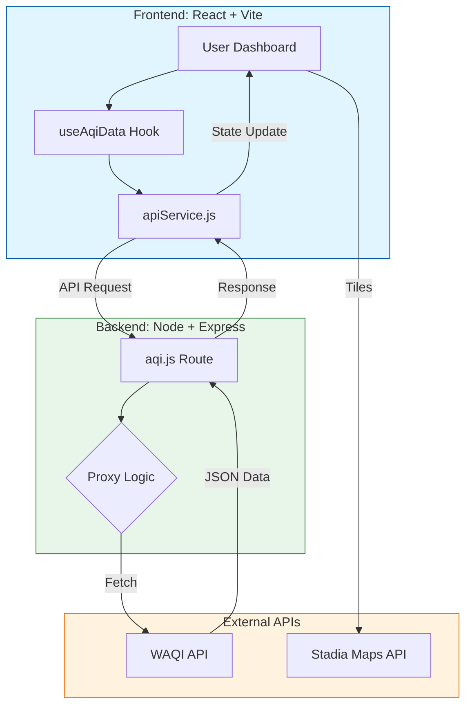

# BreatheEasy 🌱

[Explore the Website](https://breathe-easy-1.vercel.app)

BreatheEasy is an open-source project that helps you monitor air quality in your area, understand pollutant levels, and take informed actions for better health. It lets you search and explore real-time air quality data from any city around the world. Featuring a live AQI dashboard, interactive maps, and detailed pollutant breakdowns, it offers tailored health guidance and community-level improvement suggestions. With dark/light mode support and a mobile-friendly UI, BreatheEasy makes understanding air quality simple, informative, and accessible.

---

## **_Appreciate the project by giving this repository a Star ⭐_**

[](https://github.com/prasoonk1204/BreatheEasy) [](https://github.com/prasoonk1204/BreatheEasy/pulls)
[](https://github.com/ellerbrock/open-source-badges/) [](https://choosealicense.com/licenses/mit/) [](https://gssoc.girlscript.tech/) [](https://beta.swoc.in/)

### Please read the [CONTRIBUTING.md](./CONTRIBUTING.md) before contributing.

---

## ✨ Features

| Feature | Description |
| :--- | :--- |
| **🌍 Live Dashboard** | Real-time AQI for your current location at a glance. |
| **🔍 City Search** | Explore specific pollutants (PM2.5, O₃, NO₂, SO₂, etc.) globally. |
| **🗺️ Interactive Maps** | Visualize air quality trends across regions via Stadia Maps. |
| **🏥 Health Advice** | Receive tailored health precautions based on current air quality levels. |
| **📊 7-Day Forecast** | View interactive charts and trends for upcoming air quality changes. |
| **🌓 Dark Mode** | Fully responsive UI with seamless dark and light theme support. |
| **💡 Improvement Tips** | Learn actionable community-level steps to help improve local air quality. |

---

## 🏗️ Architecture



---

## Project Structure

<details>
<summary>📂 <b>Click to view Project Structure</b></summary>

```text
BreatheEasy/
│
├── client/                              # Frontend application (React + Vite)
│
│   ├── public/                          # Public static assets used directly by the      browser
│   │   ├── favicon.png                  # Website favicon icon
│   │   ├── detailed_analytics.png       # Landing page illustration
│   │   ├── global_coverage.png          # Landing page illustration
│   │   ├── interactive_visualization.png# Landing page illustration
│   │   ├── personalised_health_advice.png # Landing page illustration
│   │   ├── predictive_forecasting.png   # Landing page illustration
│   │   └── real_time_monitoring.png     # Landing page illustration
│
│   ├── src/                             # Main frontend source code
│   │
│   │   ├── components/                  # All reusable React components
│   │   │
│   │   │   ├── landing/                 # Components for landing page sections
│   │   │   │   ├── About.jsx            # About section UI
│   │   │   │   ├── ContributorTestimonials.tsx # Contributors showcase section
│   │   │   │   ├── Features.jsx         # Features section UI
│   │   │   │   └── landing.css          # Styles for landing page sections
│   │   │
│   │   │   ├── skeletons/               # Loading placeholder components
│   │   │   │   └── DashboardSkeleton.jsx # Skeleton loader for dashboard page
│   │   │
│   │   │   ├── ui/                      # Generic UI building blocks (design system)
│   │   │   │   ├── aurora-background-demo.tsx  # Demo for animated background
│   │   │   │   ├── aurora-background.tsx       # Animated background component
│   │   │   │   ├── button.tsx                  # Reusable button component
│   │   │   │   ├── cta-4.tsx                   # Call-to-action UI section
│   │   │   │   ├── input.tsx                   # Input field component
│   │   │   │   ├── label.tsx                   # Label UI component
│   │   │   │   ├── menu-toggle.tsx             # Mobile menu toggle button
│   │   │   │   ├── sheet.tsx                   # Sliding drawer / modal component
│   │   │   │   ├── simple-header.tsx           # Header layout component
│   │   │   │   ├── modern-animated-footer.tsx  # Animated footer component
│   │   │   │   └── testimonials-columns-1.tsx  # Testimonials layout UI
│   │   │
│   │   │   ├── AQICard.jsx              # Displays main AQI value
│   │   │   ├── AQIScaleTable.jsx        # AQI scale reference table
│   │   │   ├── ErrorAirChart.jsx        # Error UI for chart failures
│   │   │   ├── LanguageToggle.jsx       # Language switch dropdown
│   │   │   ├── Layout.jsx               # Common layout wrapper for pages
│   │   │   ├── MapComponent.jsx         # Map visualization for AQI
│   │   │   ├── Navbar.jsx               # Top navigation bar
│   │   │   ├── PollutantDetails.jsx     # Pollutant breakdown display
│   │   │   ├── ScrollToTop.jsx          # Auto scroll on route change
│   │   │   ├── Sidebar.jsx              # Sidebar navigation menu
│   │   │   ├── Suggestions.jsx          # Health advice based on AQI
│   │   │   └── Testimonials.tsx         # User testimonials section
│   │
│   │   ├── constants/                   # Static configuration & data files
│   │   │   ├── contributors.js          # Contributors list
│   │   │   ├── features.js              # Features data for landing page
│   │   │   └── maintainers.js           # Maintainers list
│   │
│   │   ├── hooks/                       # Custom React hooks
│   │   │   ├── useAqiData.js            # Fetch & manage AQI data
│   │   │   └── useTheme.js              # Handle dark/light theme
│   │
│   │   ├── lib/                         # Shared utility logic & helper functions
│   │   │   └── utils.ts                 # Common utility functions used across app
│   │
│   │   ├── pages/                       # Route-level page components
│   │   │   ├── AirQualityChart.jsx      # AQI graph visualization page
│   │   │   ├── Dashboard.jsx            # Main dashboard page
│   │   │   ├── ExploreAQI.jsx           # City AQI search page
│   │   │   ├── ImprovementMeasures.jsx  # Air quality improvement tips page
│   │   │   ├── LandingPage.jsx          # Website landing page
│   │   │   └── Precautions.jsx          # Health precautions page
│   │
│   │   ├── services/                    # API communication layer
│   │   │   └── apiService.js            # Backend API request handler
│   │
│   │   ├── utils/                       # Standalone helper utilities
│   │   │   └── fetchAQIData.js         ️           # External AQI data fetcher
│   │
│   │   ├── App.jsx                      # Root React component
│   │   ├── main.jsx                     # Application entry point
│   │   └── index.css                    # Global CSS styles
│
│   ├── .example.env                     # Sample environment variables
│   ├── .gitignore                       # Git ignore rules
│   ├── components.json                 # UI components configuration
│   ├── eslint.config.js                 # ESLint configuration
│   ├── index.html                       # Main HTML template
│   ├── package.json                    # Frontend dependencies & scripts
│   ├── tsconfig.json                   # TypeScript configuration
│   ├── tsconfig.node.json              # Node-specific TS config
│   ├── vercel.json                     # Vercel deployment settings
│   └── vite.config.js                  # Vite build configuration
│
├── server/                              # Backend application (Node + Express)
│   ├── routes/
│   │   └── aqi.js                       # AQI API routes
│   ├── app.js                           # Express server entry file
│   ├── package.json                    # Backend dependencies
│   ├── package-lock.json               # Locked dependency versions
│   └── .gitignore                      # Backend git ignore rules
│
├── CONTRIBUTING.md                      # Contribution guidelines
├── LICENSE.md                           # MIT license
└── README.md                            # Main project documentation
```
</details>

---

## 🚀 Getting Started

### 📋 Prerequisites

* **Node.js**: `v18.0.0` or higher
* **npm**: `v9.0.0` or higher (or Yarn/pnpm)
* **Browser**: A modern evergreen browser (Chrome, Edge, Firefox)

### 1. Clone the Repository
```sh
git clone https://github.com/prasoonk1204/BreatheEasy.git
cd BreatheEasy
```

### 2. Set Up the Frontend
```sh
cd client
npm install
# or
yarn install
```

#### .env Setup
Copy `.example.env` to `.env`:
```sh
cp .example.env .env
```
Edit `.env` and add your API keys:
```
VITE_STADIAMAPS_API_KEY=your_stadiamaps_api_key_here
VITE_API_BASE_URL=http://localhost:3000
```
- **Stadia Maps API Key:**
  - Go to [Stadia Maps](https://stadiamaps.com/).
  - Sign up for a free account (no credit card required for the free tier).
  - In your dashboard, go to "Manage Properties" → "Authentication Configuration" to generate/view your API key.
  - Copy and paste it as `VITE_STADIAMAPS_API_KEY` in your `.env` file.

#### Start the frontend:
```sh
npm run dev
# or
yarn dev
```
Open [http://localhost:5173](http://localhost:5173) in your browser.

### 3. Set Up the Backend
```sh
cd ../server
npm install
# or
yarn install
```

### 🔑 Environment Configuration

Before running the application, you must configure the environment variables for both the frontend and backend.

| Variable | Required In | Source | Purpose |
| :--- | :--- | :--- | :--- |
| `VITE_STADIAMAPS_API_KEY` | `client/.env` | [Stadia Maps](https://stadiamaps.com/) | Renders the interactive map tiles |
| `VITE_API_BASE_URL` | `client/.env` | Local / Deployed URL | Connects frontend to your proxy server |
| `WAQI_API_KEY` | `server/.env` | [WAQI API](https://aqicn.org/api/) | Authenticates requests to fetch AQI data |
| `PORT` | `server/.env` | Local Preference | Defines the backend server port (default: 3000) |

> [!IMPORTANT]
> Ensure your `.env` files are added to `.gitignore` to prevent leaking your API keys to GitHub.

Create a `.env` file in the `server` directory and add your WAQI API key:
```
WAQI_API_KEY=your_waqi_api_key_here
PORT=3000
```
- **WAQI API Key:** [Get your key here](https://aqicn.org/data-platform/token/#/).

Start the backend server:
```sh
npm start
# or
yarn start
```

The backend will run on [http://localhost:3000](http://localhost:3000) by default.

---

## Tech Stack

- [React](https://react.dev/) + [Vite](https://vitejs.dev/) (Frontend)
- [Tailwind CSS](https://tailwindcss.com/) (Frontend)
- [Chart.js](https://www.chartjs.org/) (Frontend)
- [Node.js](https://nodejs.org/) + [Express](https://expressjs.com/) (Backend)
- [WAQI API](https://aqicn.org/api/) (AQI Data)
- [Stadia Maps](https://stadiamaps.com/) (Map tiles)

---

### Maintainer

- Prasoon Kumar - [@prasoonk1204](https://github.com/prasoonk1204)

---

**Happy Contributing!**
